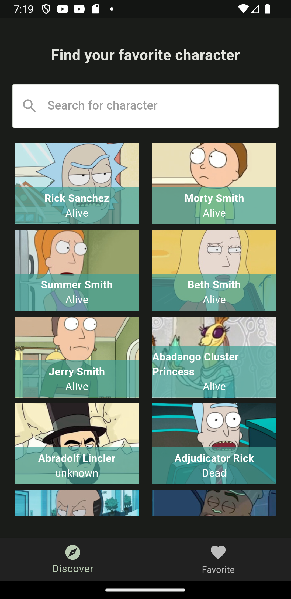
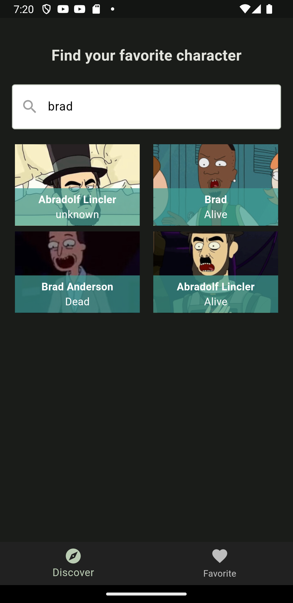

# rick_and_morty

Esta es una aplicación que consume la API de Rick and Morty, la cual muestra los personajes de la serie, con sus respectivas características, y permite filtrarlos por nombre y por estado.

## Empezando

Este proyecto es un punto de partida para una aplicación Flutter.

Algunos recursos para comenzar si este es tu primer proyecto Flutter:

- [Laboratorio: Escribe tu primera aplicación Flutter](https://docs.flutter.dev/get-started/codelab)
- [Recetario: Ejemplos útiles de Flutter](https://docs.flutter.dev/cookbook)

Para obtener ayuda para comenzar con el desarrollo de Flutter, consulta la
[documentación en línea](https://docs.flutter.dev/), que ofrece tutoriales,
ejemplos, orientación sobre el desarrollo móvil y una referencia completa de la API.

## Instalación

Para poder correr el proyecto, es necesario tener instalado Flutter en su versión 2.2.3 o superior, y Dart en su versión 2.13.4 o superior.

## Ejecución

Para ejecutar el proyecto, es necesario tener un dispositivo Android o iOS conectado, o un emulador de alguno de estos sistemas operativos. Luego, se debe ejecutar el siguiente comando en la terminal:

```bash
flutter run
```

## Features

- [x] Pantalla de inicio con la lista de personajes
- [x] Buscador de personajes
- [ ] Pantalla de detalle de personaje
- [ ] Pantalla de favoritos

## Capturas de pantalla


